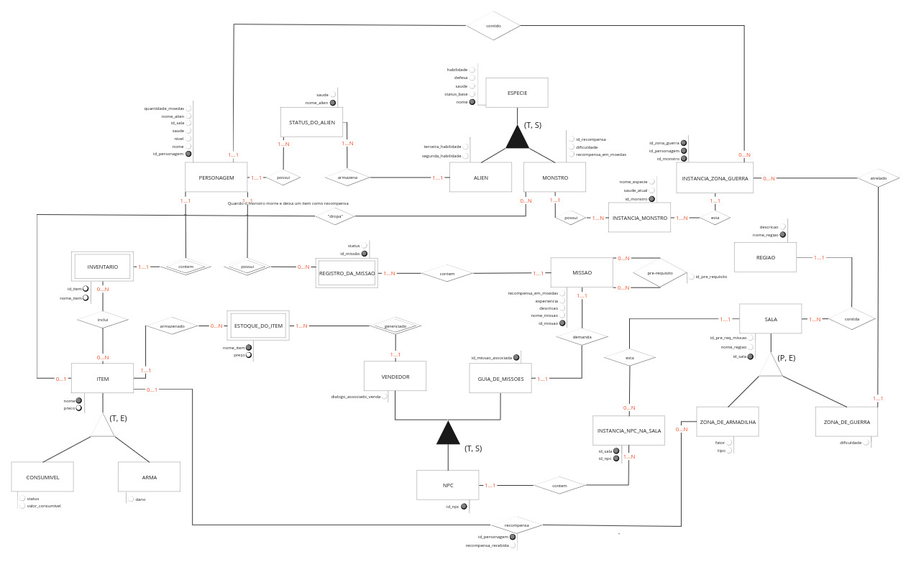

# Diagrama Entidade Relacionamento

## <a>Introdução</a>

De acordo com Elmasri e Navathe<a id="anchor_1" href="#REF1">^1^</a>, a modelagem conceitual é uma etapa fundamental no desenvolvimento de uma aplicação de banco de dados bem-sucedida. Esta fase envolve o design das estruturas e restrições do banco de dados, bem como a elaboração de programas para realizar consultas e atualizações. A modelagem conceitual não apenas facilita a compreensão e o planejamento do banco de dados, mas também assegura a eficiência e a segurança das operações.

O Diagrama Entidade Relacionamento (DER) é uma representação gráfica do Modelo Entidade Relacionamento (MER). Ele é composto por entidades, relacionamentos e atributos. As entidades são representadas por retângulos, os atributos são representados por elipses e os relacionamentos são representados por losangos.<a id="anchor_1" href="#REF1">^1^</a>

## <a>Objetivo</a>

O Diagrama Entidade-Relacionamento (DER) deve fornecer uma representação visual clara e estruturada do [Modelo Entidade Relacionamento](https://sbd1.github.io/2024.1-Ben10/modulo1/MER/), facilitando a compreensão das entidades, relacionamentos e atributos dentro de um banco de dados. Ele serve para ilustrar como diferentes entidades se conectam e interagem entre si, além de definir os atributos específicos de cada entidade e as associações entre elas.

## <a>Diagrama Entidade Relacionamento</a>

??? - "Primeira Versão do Diagrama Entidade Relacionamento"

    A figura 1 a seguir mostra a primeira versão do Diagrama Entidade Relacionamento desenvolvido pelo grupo:

    <figure markdown>
    
<b>Figura 1</b> - Primeira Versão do Diagrama Entidade Relacionamento.

    {width: 500}

    
Fonte: [Arthur Alves](https://github.com/Arthrok), [Eric Silveira](https://github.com/ericbky), [João Artur](https://github.com/joao-artl) e [Rodolfo Cabral](https://github.com/roddas).

### <a>Versão atual</a>

A figura 2 a seguir mostra a segunda e atual versão do Diagrama Entidade Relacionamento desenvolvido pelo grupo:

<figure markdown>

<b>Figura 2</b> - Segunda e atual versão do Diagrama Entidade Relacionamento.

{width: 500}

Fonte: [Arthur Alves](https://github.com/Arthrok), [Eric Silveira](https://github.com/ericbky), [João Artur](https://github.com/joao-artl) e [Rodolfo Cabral](https://github.com/roddas).

A figura 3 exibe o Diagrama Entidade relacionamento desenvolvido pelo grupo na plataforma Miro, para uma melhor visualização e navegação pelo diagrama desenvolvido:

<figure markdown>

<b>Figura 3</b> - Diagrama Entidade Relacionamento para navegação.

<iframe width="768" height="500" src="https://miro.com/app/live-embed/uXjVKyitvt0=/?moveToViewport=-4530,-2109,10350,6576&embedId=114192275621" frameborder="0" scrolling="no" allow="fullscreen; clipboard-read; clipboard-write" allowfullscreen></iframe>

Fonte: [Arthur Alves](https://github.com/Arthrok), [Eric Silveira](https://github.com/ericbky), [João Artur](https://github.com/joao-artl) e [Rodolfo Cabral](https://github.com/roddas).

</figure>

## <a>Referência Bibliográfica</a>

> <a id="REF1" href="#anchor_1">1.</a> ELMASRI, Ramez; NAVATHE, Shamkant B. Sistemas de banco de dados. Tradução: Daniel Vieira. Revisão técnica: Enzo Seraphim; Thatyana de Faria Piola Seraphim. 6. ed. São Paulo: Pearson Addison Wesley, 2011. Capítulo 7. Modelagem de dados usando o modelo Entidade-Relacionamento (ER), página 146 e 147.

## <a>Bibliografia</a>

> Diagrama Entidade Relacionamento Stardew Valley. Disponível em: <https://github.com/SBD1/2023.2-Grupo01-StardewValley/blob/main/docs/Entrega-01/DER_StardewValley_v1.0.md>. Acesso em 20 de julho de 2024.

> Diagrama Entidade Relacionamento Bruvic. Disponível em: <https://github.com/SBD1/Grupo12_Bruvic/blob/main/Modulo%201%20-%20DER/der_bruvic_v1.png>. Acesso em 20 de julho de 2024.

## <a>Histórico de Versão</a>

| Versão| Data | Descrição  | Autor(es)  | Revisor(es) |
| ----- |----- | ---------- | ---------- | ----------- | 
| `1.0` | 20/07| Criando DER |[Arthur Alves](https://github.com/Arthrok), [Eric Silveira](https://github.com/ericbky), [João Artur](https://github.com/joao-artl) e [Rodolfo Cabral](https://github.com/roddas)| [João Artur](https://github.com/joao-artl) |