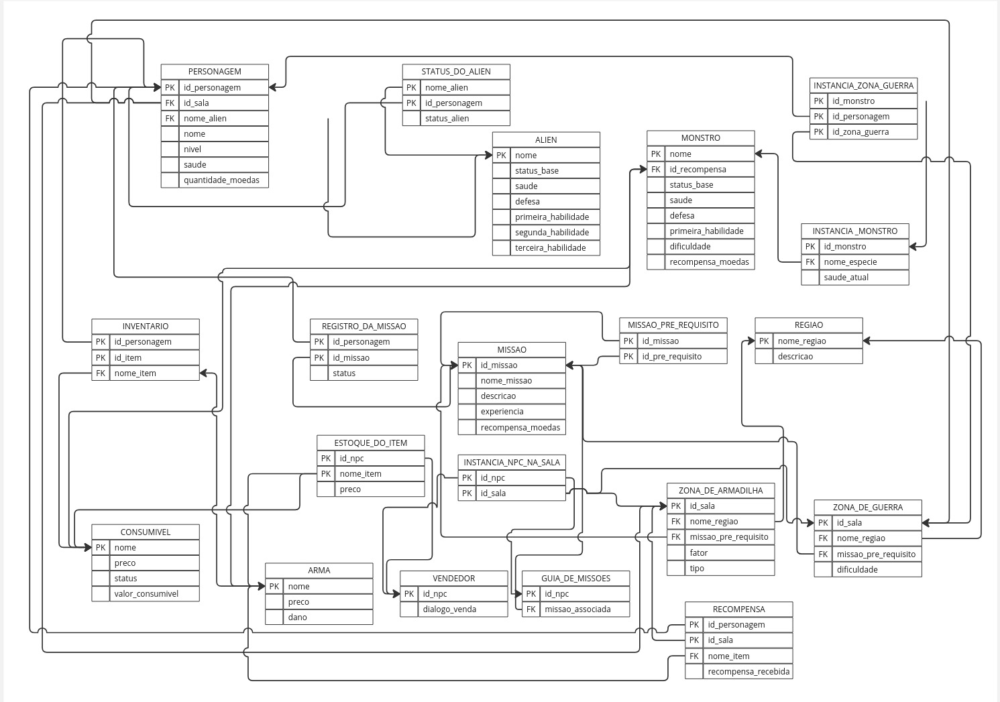

## <a>Modelo Relacional</a>
A figura 1 a seguir exibe o Modelo Relacional desenvolvido pelo grupo:

<b>Figura 1</b> - Modelo Relacional para navegação.

{width: 500}

Fonte: [Arthur Alves](https://github.com/Arthrok) e [Eric Silveira](https://github.com/ericbky).

A figura 2 exibe o Modelo Relacional desenvolvido pelo grupo na plataforma Miro, para uma melhor visualização e navegação pelo diagrama desenvolvido:

<b>Figura 2</b> - Modelo Relacional para navegação.

<iframe width="768" height="432" src="https://miro.com/app/live-embed/uXjVKw6wS9U=/?moveToViewport=1063,-752,1750,1241&embedId=61056314889" frameborder="0" scrolling="no" allow="fullscreen; clipboard-read; clipboard-write" allowfullscreen></iframe>

Fonte: [Arthur Alves](https://github.com/Arthrok) e [Eric Silveira](https://github.com/ericbky).

## <a>Referência Bibliográfica</a>

> <a id="REF1" href="#anchor_1">1.</a> ELMASRI, Ramez; NAVATHE, Shamkant B. Sistemas de banco de dados. Tradução: Daniel Vieira. Revisão técnica: Enzo Seraphim; Thatyana de Faria Piola Seraphim. 6. ed. São Paulo: Pearson Addison Wesley, 2011. Capítulo 7. Modelagem de dados usando o modelo Entidade-Relacionamento (ER), página 146 e 147.

## <a>Bibliografia</a>

> Modelo Relacional, Stardew Valley. Disponível em: <https://github.com/SBD1/2023.2-Grupo01-StardewValley/blob/main/docs/Entrega-01/MREL_StardewValley_v1.0.md>. Acesso em 21 de julho de 2024.

> Modelo Relacional, Bruvic. Disponível em: <https://github.com/SBD1/Grupo12_Bruvic/tree/main/Modulo%202%20-%20Modelo%20Relacional>. Acesso em 21 de julho de 2024.

## <a>Histórico de Versão</a>

| Versão| Data | Descrição  | Autor(es)  | Revisor(es) |
| ----- |----- | ---------- | ---------- | ----------- | 
| `1.0` | 21/07| Criando o Modelo Relacional |[Arthur Alves](https://github.com/Arthrok) e [Eric Silveira](https://github.com/ericbky)| [João Artur](https://github.com/joao-artl) |